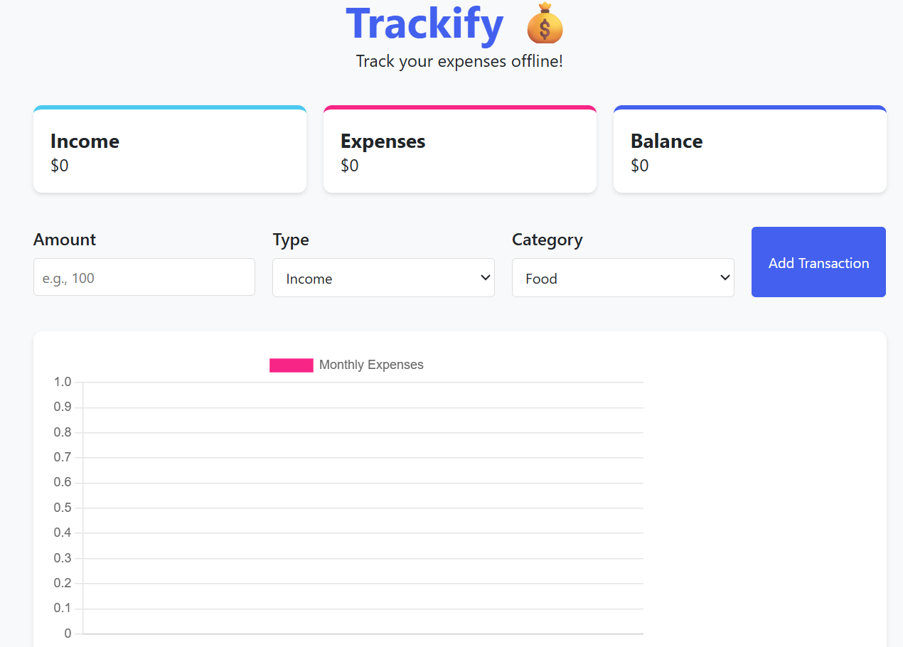

# 💸 Trackify - PWA Expense Tracker

**Trackify** is a lightweight and responsive **Progressive Web App (PWA)** for managing and visualizing daily expenses. With full offline support and clean visual analytics, it's designed for users who want a fast, intuitive, and secure way to track spending.

---

## 🚀 Features

- ✅ Add, edit, and delete expense records
- 📅 Automatic timestamp for each transaction
- 📊 Visual expense trends using **Chart.js**
- 💾 Offline-first with **localStorage**
- 📱 Fully installable as a PWA (manifest + service worker)
- 🔒 No user login required — your data stays private on your device

---

## 🛠️ Tech Stack

- **HTML5**, **CSS3**, **JavaScript (ES6+)**
- **Chart.js** for real-time charts and data visualization
- **localStorage** for persistent client-side storage
- **PWA technologies**: Service Worker + Web App Manifest

---
🌐 Live Demo
🔗 
